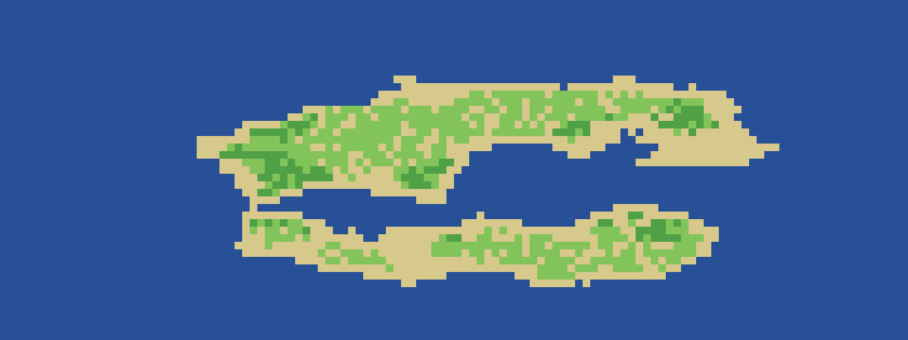
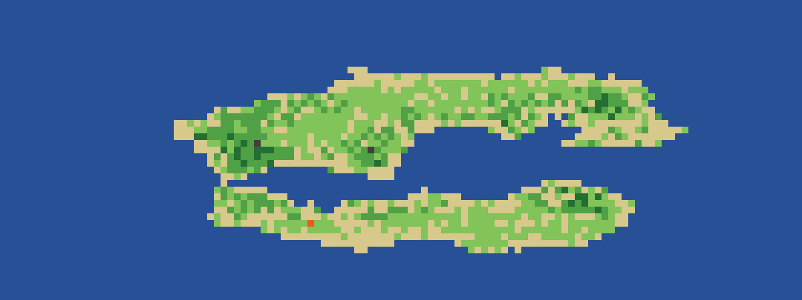
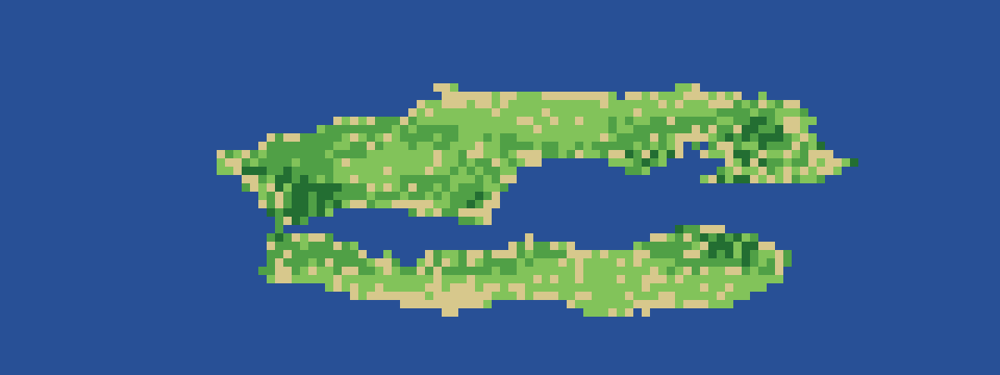
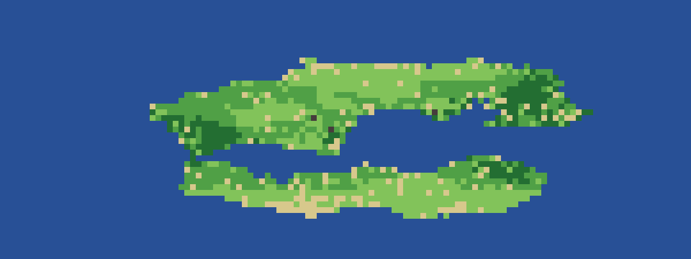

# Procedural World Simulation with Cellular Automata
### Project Report

**Author:** JazzXHiro
**Language:** C++17 (single file, zero external dependencies)
**Deliverables:** `world_gen.cpp` (generator), `world_sim.cpp` (simulation)

---

## 1. Abstract

This project builds a small, self-contained **world simulator**. It works in two
phases. First, a **procedural generator** synthesises a plausible landscape —
oceans, beaches, lowlands and peaks — from layered Perlin noise. Second, a
**cellular automaton (CA)** brings that landscape to life: vegetation grows and
matures through ecological succession, wildfires ignite and spread, burnt land
turns to ash and regrows, and a seasonal climate cycle drives recurring fire
seasons. The result is a system with no scripted events, yet visibly *emergent*
behaviour — waves of growth and fire that never repeat identically but stay in a
stable dynamic equilibrium.

---

## 2. Background

### 2.1 Procedural generation with Perlin noise
Perlin noise is a *coherent* gradient noise: nearby points get similar values,
so it produces smooth, natural-looking variation instead of white-noise static.
Summing several octaves of it at rising frequency and falling amplitude —
**fractal Brownian motion (fBm)** — yields terrain with both broad continents
and fine coastline detail. Two independently-seeded noise fields are used, one
for **elevation** and one for **moisture**, so climate is not merely a function
of height.

### 2.2 Cellular automata
A cellular automaton is a grid of cells, each in one of a finite set of states,
that all update **simultaneously** according to a rule depending only on a cell
and its neighbours. Despite the simplicity of the local rules, CAs are famous
for producing complex global behaviour (Conway's *Game of Life*, the
Drossel–Schwabl *forest-fire model*). This project extends the forest-fire model
into a fuller ecosystem.

---

## 3. System Architecture

```
                 ┌────────────────────────┐
   seed ───────► │  Procedural Generator  │   Perlin fBm × 2
                 │  elevation + moisture  │   (+ optional island falloff)
                 └───────────┬────────────┘
                             │ initial state (terrain → cells)
                             ▼
                 ┌────────────────────────┐
                 │   Cellular Automaton   │◄──── seasonal climate cycle
   each step ──► │  synchronous update,   │
                 │  double-buffered grid  │
                 └───────────┬────────────┘
                             │ current grid
              ┌──────────────┴───────────────┐
              ▼                               ▼
     ANSI truecolor animation        PPM image / population census
```

The two phases share the same grid representation, so the generator's output is
literally the automaton's `t = 0` state.

---

## 4. The Cellular Automaton

### 4.1 Cell states

| State | Glyph | Role |
|-------|:-----:|------|
| Water | `~` | static ocean / lake |
| Snow | `*` | static high peaks |
| Rock | `^` | barren highland (rarely greens where wet) |
| Sand | `.` | bare / arid ground; can be colonised |
| Ash | `%` | freshly burnt, fertile ground |
| Grass | `,` | pioneer vegetation, light fuel |
| Shrub | `;` | intermediate vegetation |
| Forest | `T` | mature vegetation, heavy fuel |
| Burning | `@` | active fire (lasts one step) |

### 4.2 Transition rules (each applied per cell, per step)

Every land cell computes its next state from its current state, its **moisture**,
its 8 **Moore neighbours**, and the current **season**:

1. **Colonisation:** `Sand → Grass` with probability ∝ moisture.
2. **Succession:** `Grass → Shrub → Forest`, each step gated by sufficient
   moisture. This is the classic old-field succession of an ecosystem.
3. **Ignition (lightning):** any flammable cell may spontaneously ignite with a
   small probability scaled by *dryness* and by *fuel load* (forest ignites more
   readily than grass).
4. **Ignition (spread):** a flammable cell with burning neighbours ignites with a
   probability evaluated independently per burning neighbour — so fire fronts
   advance stochastically rather than in lockstep.
5. **Burnout:** `Burning → Ash` after exactly one step.
6. **Regrowth:** `Ash → Grass` quickly (ash is fertile); under drought it may
   instead revert to `Sand`.
7. **Drought / desertification:** `Grass → Sand` where moisture is very low.
8. **Alpine:** `Rock → Grass` rarely, only where very wet.

### 4.3 Climate model

Dryness for a cell at step *t* is

```
dryness = (1 − moisture) × season(t),   season(t) = 1 + A·sin(2π t / P)
```

The `season` term (amplitude `A`, period `P`) makes the whole map swing between
wet and dry phases, producing **recurring fire seasons** — fires cluster when
`season` peaks and die back when it troughs.

### 4.4 Update discipline

The automaton is **synchronous**: the next state of every cell is computed from a
read-only snapshot of the current grid, then the whole grid is swapped in at
once. This is implemented with **double buffering** (two grids, `std::swap` of
the state vectors each step), which avoids the bug where a cell updated early in
a scan would incorrectly influence its not-yet-updated neighbours.

---

## 5. Implementation Notes

- **Single translation unit, no dependencies.** Only the C++ standard library.
- **Determinism.** A given `--seed` fully determines both terrain and evolution,
  because the single `std::mt19937` stream is consumed in a fixed order.
- **Complexity.** Each step is `O(W·H)` with a constant 8-neighbour scan;
  memory is `O(W·H)`. A 120×45 world runs hundreds of steps in a fraction of a
  second (the visible pacing is a deliberate `--delay`).
- **Rendering.** The terminal view uses ANSI 24-bit colour with cursor-home
  redraw for animation; on Windows, virtual-terminal processing is enabled at
  startup so colours work in the classic console too. Still frames are written
  as binary **PPM** (trivially convertible to PNG).

---

## 6. Results

Deterministic run: `--seed 7 --island`. Snapshots of the same world evolving:

| Step 0 (initial terrain) | Step 60 |
|:---:|:---:|
|  |  |
| **Step 150** | **Step 320** |
|  |  |

Population census (share of all cells), same run:

| Step | Sand | Grass | Shrub | Forest |
|-----:|-----:|------:|------:|-------:|
| 0    | 25.3% | 41.8% | 22.3% |  0.0% |
| 100  | 15.2% | 32.4% | 32.2% |  8.6% |
| 200  |  8.6% | 28.5% | 36.5% | 15.6% |
| 300  |  5.3% | 27.9% | 36.6% | 18.6% |

**Reading the results.** Bare sand is steadily colonised and climbs the
succession ladder, so shrub and forest cover rise over time while sand falls.
Rather than growing without bound, the system settles toward a **dynamic
equilibrium**: forest accumulates until a dry-season fire clears a patch (visible
as transient spikes in the Ash and Burning counts), which then regrows — the
same growth/disturbance cycle seen in real fire-adapted ecosystems.

---

## 7. Emergent Behaviour

Nothing in the code scripts a fire or a forest. All large-scale patterns —
advancing fire fronts, mosaics of different-aged vegetation, the boom-and-bust of
forest cover — arise purely from local rules applied uniformly. This is the
central lesson the project demonstrates: **simple local rules + many cells =
complex global behaviour.**

---

## 8. Limitations & Future Work

- **Moisture is static.** A natural extension is a hydrology layer where water
  flows downhill, carving rivers and feeding a dynamic moisture field.
- **Fire has no wind bias.** Adding a wind vector would bias spread directionally
  and make fire fronts more realistic.
- **No fauna.** A predator–prey agent layer on top of the vegetation CA would add
  another feedback loop.
- **Output.** Direct PNG/GIF export (e.g. via `stb_image_write`) would remove the
  PPM-conversion step and allow recorded animations.

---

## 9. Build & Run

```bash
# Simulation
g++ -std=c++17 -O2 -o world_sim world_sim.cpp        # or clang++, or MSVC cl
./world_sim --seed 7 --island                        # watch it evolve
./world_sim --no-ascii --stats --steps 300           # headless census
./world_sim --img 10                                 # final frame -> world_sim.ppm

# Static generator (phase 1 only)
g++ -std=c++17 -O2 -o world_gen world_gen.cpp
./world_gen --island
```

## 10. File Manifest

| File | Purpose |
|------|---------|
| `world_gen.cpp` | Phase 1: procedural terrain generator (static map + image) |
| `world_sim.cpp` | Phase 2: cellular-automaton ecosystem simulation |
| `REPORT.md` | This report |
| `SCRIPT.md` | Spoken walkthrough / demo script |
| `README.md` | Quick-start build & run instructions |
